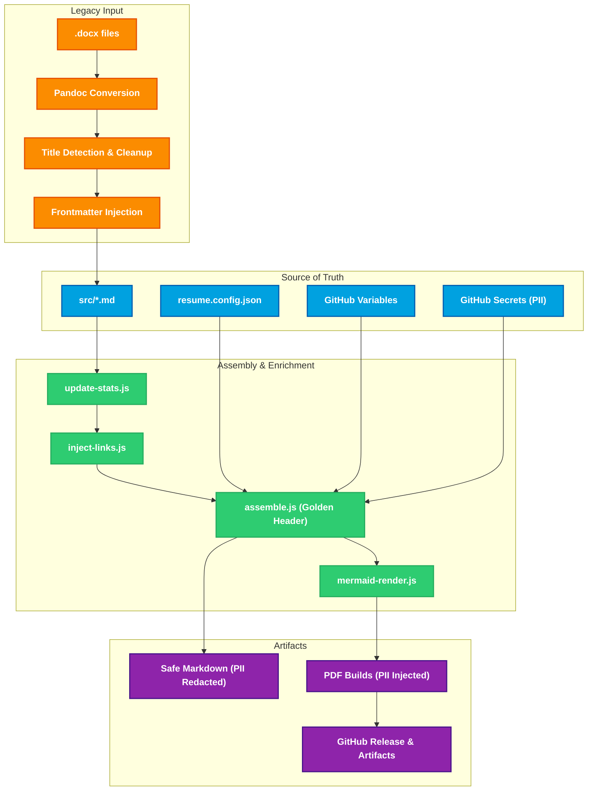

# Resume as Code


**This repository treats my professional career documentation as a software product.** Instead of manually editing Word documents, this project uses a **fully automated CI/CD pipeline** to compile resumes from clean Markdown source, inject live metadata, and enforce strict governance on PII and formatting.

## Architecture & Pipeline

Commits to `src/`, `scripts/`, or `.github/workflows/`, as well as manual triggers, execute the GitHub Actions workflow that builds and distributes resumes.



### Pipeline Stages

1. **Legacy Import:** `npm run import` converts local `.docx` files, automatically detects job titles, sanitizes PII, and generates Markdown with YAML Frontmatter.
2. **Source Separation:** All source files live in `src/`. Distribution artifacts are generated in `dist/` (gitignored).
3. **Governance & Assembly:** `assemble.js` reads `resume.config.json` and Frontmatter, injects the "Golden Header," and prepares Safe Markdown (`markdown/`) and PII-enabled PDFs.
4. **Real-Time Enrichment:** `update-stats.js` pulls ADR counts from GitHub, and `inject-links.js` updates links in Markdown automatically.
5. **Mermaid Rendering:** Diagrams are rendered via `mermaid-render.js` after headers and links are processed.
6. **Compilation:** Pandoc + XeLaTeX produces print-ready PDFs in `dist/`. These are included in GitHub Releases and/or uploaded via artifacts, but never committed to the repo.

---

## Key Features

### Security-First Architecture

- **PII Decoupling:** Contact info is stored in GitHub Secrets (masked) and never appears in source history.
- **Safe Web View:** The `markdown/` folder contains "Safe Mode" resumes (redacted PII) suitable for public web hosting.
- **Bot-Resistant:** PII only injected at build time for PDFs.

### Automated Governance

- **Docs-as-Code:** YAML Frontmatter (`title: Platform Engineer`) allows infinite resume variants from a single source.
- **Standardized Identity:** The "Golden Header" ensures consistent branding.
- **Idempotency:** Build output is deterministic; multiple executions yield the same results.

### Real-Time Features

- **ADR Stats:** Automatically pulls Architectural Decision Record counts from GitHub and injects them into resumes.
- **Link Injection:** Smart injection and verification of URLs from `resume.config.json`.
- **Mermaid Diagrams:** Auto-rendered to PNG and embedded in Markdown before PDF build.

---

## Tech Stack

- **Core:** Markdown, Pandoc, XeLaTeX
- **Scripting:** Node.js
- **Diagrams:** Mermaid.js via Puppeteer
- **CI/CD:** GitHub Actions
- **Fonts:** Liberation Serif & Sans (cross-platform deterministic builds)

### Fonts

> [!IMPORTANT]
> Liberation fonts are licensed under GPL v2 with a font exception.
> See [fonts/liberation/LICENSE](fonts/liberation/LICENSE) for details.

## Usage

### 1. Install Prerequisites

- **Node.js 20+**
- **Pandoc** (for PDF generation)
- **MiKTeX / TeX Live** (XeLaTeX engine)

### 2. Install Fonts (Required for Local Build)

The build requires **Liberation Serif** and **Liberation Sans**.

1.  Run the downloader script:
    ```bash
    npm run download-fonts
    ```
2.  Install the fonts manually:
    - **Windows**: Open `fonts/liberation`, select all `.ttf` files, Right-click -> **Install**.
    - **macOS**: Open **Font Book**, click the `+` button, and select the `.ttf` files from `fonts/liberation`.
    - **Linux**:
      ```bash
      mkdir -p ~/.local/share/fonts
      cp fonts/liberation/*.ttf ~/.local/share/fonts/
      fc-cache -f -v
      ```

### 3. Build

Generate PDFs and Safe Markdown in `dist/`:

```bash
npm run build
```

## Project Structure

```text
resume-as-code/
├── .github/                # CI/CD workflows (GitHub Actions)
│   └── workflows/
├── src/                    # SOURCE OF TRUTH: Markdown resumes with frontmatter
│   ├── Resume.md           # Resume variant
│   └── PlatformEngineer.md # Platform Engineer variant
├── scripts/                # Build & automation logic
│   ├── assemble.js
│   ├── import-local.js
│   ├── build.js
│   ├── update-stats.js
│   └── inject-links.js
├── imports/                # Legacy inputs (.docx drop zone)
├── fonts/                  # Vendored fonts for deterministic builds
│   └── liberation/
│       ├── *.ttf
│       └── LICENSE.txt
├── markdown/               # Safe Markdown outputs (PII redacted)
├── dist/                   # Generated PDFs and intermediates (gitignored)
├── .env                    # PII for local generation (gitignored)
├── resume.config.json      # Resume variant configuration
├── puppeteer-config.json   # Puppeteer configuration
├── package.json            # Project manifest & scripts
├── README.md               # Architecture & usage documentation
└── LICENSE                 # MIT license
```
