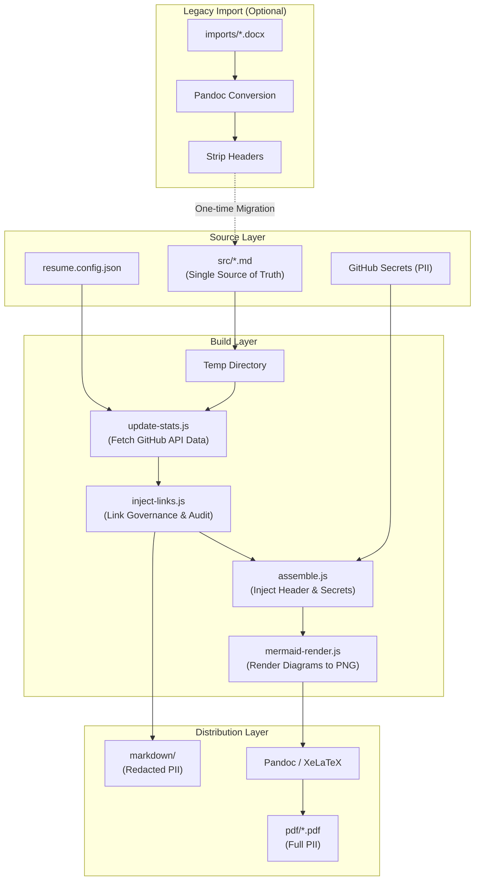

# Resume as Code


**This repository treats my professional career documentation as a software product.** Instead of manually editing Word documents, this project uses a **Zero-Touch CI/CD pipeline** to compile my resume from clean Markdown source, inject real-time data from my projects, and enforce strict governance on hyperlinks and formatting.

## 📐 Architecture & Pipeline

Every commit to `src/` triggers a GitHub Actions workflow that executes the following "Source to Distribution" pipeline:



### Pipeline Stages

1.  **Legacy Import:** Dropping a `.docx` file into `imports/` triggers a conversion workflow that cleans the file and pushes it to `src/`.
2.  **Source Separation:** The pipeline separates **Source Code** (`src/`) from **Distribution Artifacts** (`markdown/` and `pdf/`).
3.  **Governance & Link Injection:** Audits links against a "Source of Truth" configuration and publishes a "Safe Mode" (PII-redacted) version to `markdown/`.
4.  **Assembly:** Dynamically stitches together contact details (from Secrets) with the generic Markdown body for the PDF build.
5.  **Diagram Rendering:** Compiles MermaidJS code blocks into high-resolution, transparent PNGs.
6.  **Compilation:** Converts the processed Markdown into print-ready PDFs with embedded metadata using XeLaTeX.

## 🎯 Key Features

### Security-First Architecture

- **PII Decoupling:** Personal contact information stored in GitHub Secrets, decoupled from source Markdown.
- **Bot-Resistant:** Contact details only appear in compiled PDFs, not in plain-text source files.
- **Safe Web View:** The `markdown/` folder contains "Safe Mode" resumes (Name/Title only) for public viewing.

### Automated Governance

- **Real-time Statistics:** GitHub API integration fetches current portfolio metrics.
- **Link Validation:** Ensures all hyperlinks resolve correctly and follow naming conventions.
- **Idempotency:** The pipeline guarantees consistent output regardless of execution count.

### Professional Output

- **PDF Metadata:** Embedded author, title, and keywords.
- **Consistent Naming:** Both PDF and Markdown artifacts are automatically prefixed with your name (e.g., `RyanBumstead_Resume.pdf`).
- **Multi-Version Strategy:** Generates three targeted resume versions from single source:
  - **Recruiter:** ATS-optimized, scannable format.
  - **Standard:** Balanced detail for general applications.
  - **Comprehensive:** Architecture-heavy with diagrams for senior roles.

## 🛠 Tech Stack

- **Core:** Markdown, Pandoc, XeLaTeX
- **Scripting:** Node.js (Automation & API interaction)
- **Diagrams:** Mermaid.js (via Puppeteer)
- **CI/CD:** GitHub Actions
- **Fonts:** Liberation Serif & Sans (cross-platform compatibility)

## 📂 Project Structure

```
resume-as-code/
├── markdown/              # <--- AUTO-GENERATED: Safe Mode (Redacted PII) for Web View
├── src/                   # <--- EDIT HERE: Clean source content
│   ├── Resume.md
│   ├── Resume_Recruiter.md
│   └── Resume_Comprehensive.md
├── imports/               # <--- DROP BOX: Place .docx here to auto-convert
├── scripts/               # Node.js automation logic
│   ├── assemble.js        # PII injection and header assembly
│   ├── update-stats.js    # GitHub API data fetching
│   ├── inject-links.js    # Link governance and validation
│   ├── mermaid-render.js  # Diagram rendering
│   └── get-name.js        # Name formatting utility
├── pdf/                   # Final compiled artifacts (Full PII)
├── resume.config.json     # Single Source of Truth for links and metadata
└── .github/workflows/     # CI/CD pipeline definition
```

## 🚀 Quick Start

### 1. Fork & Clone

Fork this repository to your own GitHub account, then clone it locally:

```bash
git clone https://github.com/YOUR_USERNAME/resume-as-code.git
cd resume-as-code
```

### 2. Configure Secrets (The Secure Way)

Go to **Settings > Secrets and variables > Actions** in your forked repo and add the following repository secrets:

| Secret Name          | Value Example    | Description                         |
| -------------------- | ---------------- | ----------------------------------- |
| `RESUME_FIRST_NAME`  | Jane             | Your first name                     |
| `RESUME_LAST_NAME`   | Doe              | Your last name                      |
| `RESUME_TITLE`       | Senior Architect | Your professional title             |
| `RESUME_PHONE`       | 555-0100         | Contact phone number                |
| `RESUME_EMAIL`       | jane@example.com | Contact email address               |
| `RESUME_LOCATION`    | New York, NY     | City, State                         |
| `RESUME_GITHUB_USER` | janedoe          | GitHub username for API integration |

### 3. Update Content

**Option A: Edit Source**
Edit the Markdown files in the **`src/`** directory.

**Option B: Import Legacy**
Upload a `.docx` file to the `imports/` folder. The pipeline will convert it, strip the headers, and place it in `src/`.

### 4. Commit & Push

```bash
git add src/
git commit -m "feat: update experience section"
git push
```

The GitHub Actions workflow will automatically build and commit the updated PDFs.

### 5. Local Development (Optional)

If running locally, create a `.env` file in the root directory (this file is ignored by git):

```ini
RESUME_FIRST_NAME=Jane
RESUME_LAST_NAME=Doe
RESUME_TITLE=Senior Architect
RESUME_PHONE=555-0100
RESUME_EMAIL=jane@example.com
RESUME_LOCATION=New York, NY
RESUME_GITHUB_USER=janedoe
```

Then install dependencies and run the build:

```bash
npm install
# Run individual scripts or the full pipeline locally
mkdir -p temp_processed
cp src/*.md temp_processed/
node scripts/inject-links.js temp_processed
node scripts/assemble.js temp_processed "temp_processed/Resume.md" "Resume.md"
```

## 🔒 Why This Approach?

### Traditional Resume Management

- Manual Word document updates
- Version control via "Resume_v3_final_FINAL.docx"
- Contact info in plain-text files (easily scraped by bots)
- Inconsistent formatting across versions

### Resume as Code

- **Single Source of Truth:** One set of Markdown files, multiple output formats
- **Automated Governance:** Links, stats, and formatting enforced programmatically
- **Bot-Resistant PII:** Contact details only in compiled PDFs, not easily harvested by automated scrapers
- **Verifiable Architecture:** The pipeline itself demonstrates DevOps and automation skills

## 📄 License

MIT License - Feel free to fork and adapt for your own use.

## 🤝 Contributing

This is a personal project, but if you find bugs or have suggestions for improving the pipeline architecture, feel free to open an issue.
