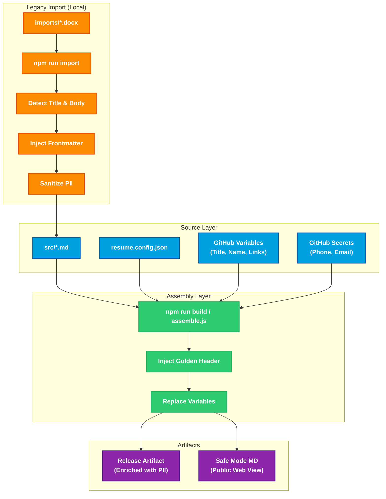

# Resume as Code


**This repository treats my professional career documentation as a software product.** Instead of manually editing Word documents, this project uses a **Zero-Touch CI/CD pipeline** to compile my resume from clean Markdown source, inject real-time data, and enforce strict governance on PII and formatting.

## 📐 Architecture & Pipeline

Every commit to `src/` triggers a GitHub Actions workflow that executes the following "Source to Distribution" pipeline:



### Pipeline Stages

1.  **Legacy Import:** The `npm run import` command converts local `.docx` files, intelligently detects job titles, and generates clean Markdown with YAML Frontmatter.
2.  **Source Separation:** The pipeline separates **Source Code** (`src/`) from **Distribution Artifacts** (`dist/` and `pdf/`).
3.  **Governance & Assembly:** The `assemble.js` engine reads `resume.config.json` and Frontmatter to determine the correct Job Title, then injects the "Golden Header" at runtime.
4.  **PII Injection:** Contact details (Phone, Email) are injected from **GitHub Secrets** only during the build process, ensuring they never appear in the source history.
5.  **Compilation:** Converts the processed Markdown into print-ready PDFs with embedded metadata using Pandoc and XeLaTeX.

## 🎯 Key Features

### Security-First Architecture

- **PII Decoupling:** Personal contact information is stored in GitHub Secrets (masked in logs), while configuration is stored in Variables.
- **Bot-Resistant:** Contact details only appear in compiled PDFs, not in plain-text source files.
- **Safe Web View:** The `markdown/` folder contains "Safe Mode" resumes (redacted PII) for public web hosting.

### Automated Governance

- **Docs-as-Code:** Resumes are defined with YAML Frontmatter (`title: Platform Engineer`), allowing for infinite variants from a single pipeline.
- **Standardized Identity:** A "Golden Header" template ensures consistent branding across all PDF outputs, regardless of the source file format.
- **Idempotency:** The pipeline guarantees consistent output regardless of execution count.

## 🛠 Tech Stack

- **Core:** Markdown, Pandoc, XeLaTeX
- **Scripting:** Node.js (Automation & API interaction)
- **Diagrams:** Mermaid.js (via Puppeteer)
- **CI/CD:** GitHub Actions
- **Fonts:** Liberation Serif & Sans (cross-platform compatibility)

## 📂 Project Structure

```text
resume-as-code/
├── src/                   # <--- SOURCE OF TRUTH: Clean Markdown with Frontmatter
│   ├── RyanBumstead_Resume.md
│   └── RyanBumstead_PlatformEngineer.md
├── imports/               # <--- DROP BOX: Place .docx here for conversion
├── scripts/               # Node.js automation logic
│   ├── assemble.js        # Template engine & Header injection
│   ├── import-local.js    # Docx conversion & Title detection
│   ├── build.js           # Local build orchestrator
│   └── update-stats.js    # GitHub API data fetching
├── resume.config.json     # Configuration for Resume Variants
└── package.json           # Project Manifest & Command definitions
```
