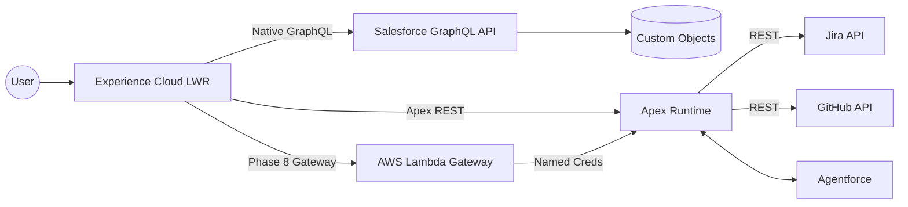

## ARCHITECT PROFILE

Principal-level Salesforce Platform Architect with **7+ years** designing governed, enterprise-grade Salesforce systems. Specializes in **architecture-first delivery**, **multi-cloud Salesforce/AWS systems**, **DevOps maturity**, and **resilience engineering**. Known for translating executive strategy into enforceable technical architecture.

---

## ARCHITECTURAL FOCUS AREAS

- Enterprise Salesforce Platform Architecture
- API-First & Contract-First Design (OpenAPI 3.0)
- DevOps Automation & Zero-Touch CI/CD
- Experience Cloud (LWR) Performance Architecture
- Multi-Cloud Integration (Salesforce + AWS)
- AI Governance & Resilience Engineering
- FinOps & Constraint-Based Design

---

## ARCHITECTURE PORTFOLIO

**Salesforce Platform Architect Portfolio**
Open-source, architecture-first reference implementation
[GitHub Repository](https://github.com/rdbumstead/salesforce-platform-architect-portfolio)

- Authored **6 enterprise architecture documents** including the [**Systems Architecture Specification (SAS)**](https://github.com/rdbumstead/salesforce-platform-architect-portfolio/blob/main/docs/guides/03-SAS.md), [**Program Charter**](https://github.com/rdbumstead/salesforce-platform-architect-portfolio/blob/main/docs/guides/02-Program-Charter.md), and [**Executable Governance Guide**](https://github.com/rdbumstead/salesforce-platform-architect-portfolio/blob/main/docs/guides/06-Guardrails-and-Executable-Governance.md).
- Documented **26 [Architectural Decision Records (ADRs)](https://github.com/rdbumstead/salesforce-platform-architect-portfolio/tree/main/docs/adr)** covering security, performance, AI governance, FinOps, and resilience.
- Designed a **multi-cloud architecture** using Salesforce LWR, Apex, Agentforce AI, and AWS Lambda.
- Implemented **contract-first APIs** ([**System API**](https://github.com/rdbumstead/salesforce-platform-architect-portfolio/blob/main/docs/api/oas/salesforce-sapi.md) & [**Process API**](https://github.com/rdbumstead/salesforce-platform-architect-portfolio/blob/main/docs/api/oas/portfolio-papi.md)) with OpenAPI 3.0 enforcing rate limiting, caching, and observability.
- Engineered **zero-touch CI/CD pipelines** with JWT authentication, delta deployments, and automated quality gates.
- Designed **chaos engineering and resilience simulation patterns** to validate graceful degradation of third-party integrations.

---

## PROFESSIONAL EXPERIENCE

### CRM Developer (Salesforce) — Creighton University | Aug 2025 – Present

- Leading platform-level DevOps modernization and architectural standards.
- Advising IT leadership on roadmap planning and architectural risk management.
- Driving best practices for maintainability, scalability, and governance.

### Salesforce Solutions Architect (Freelance) | Oct 2021 – Present

- Acted as principal architect for Salesforce implementations across nonprofit and education sectors.
- Architected a **$5M+ grant management platform** with strict security and compliance controls.
- Delivered executive architecture reviews, proofs of concept, and governance models.

### Application Administrator — Creighton University | Jun 2021 – Aug 2025

- Administered enterprise Service Cloud environments.
- Automated Experience Cloud onboarding and identity workflows.
- Supported large-scale Experience Cloud implementations (10,000+ users).

---

## EDUCATION & CERTIFICATIONS

- Associate’s Degree — Metropolitan Community College (2025)
- Salesforce Certifications: Platform App Builder,
  Administrator I & II, Agentforce Specialist, Education Cloud Consultant,
  Data Cloud Consultant, AI Associate, Marketing Cloud Engagement Foundations
