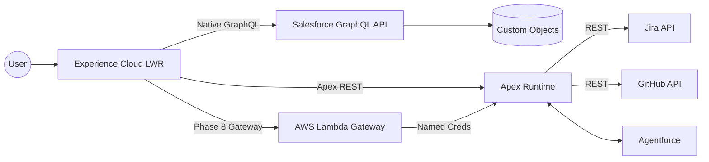

# RYAN BUMSTEAD
**Salesforce Platform Architect** | **Omaha, NE** | **[GitHub](https://github.com/rdbumstead)** | **[Portfolio](https://ryanbumstead.com)** | **[LinkedIn](https://linkedin.com/in/ryanbumstead)**

---

## Professional Summary

Principal-level Salesforce Platform Architect with **7+ years** designing governed, enterprise-grade Salesforce systems. Specializes in **architecture-first delivery**, **multi-cloud Salesforce/AWS systems**, **DevOps maturity**, and **resilience engineering**. Known for translating executive strategy into enforceable technical architecture.

## Professional Experience

**CRM Developer (Salesforce)** | Creighton University | _Aug 2025 - Present_

- Leading platform-level DevOps modernization and architectural standards.
- Advising IT leadership on roadmap planning and architectural risk management.
- Driving best practices for maintainability, scalability, and governance.

**Salesforce Solutions Architect (Freelance)** | _Oct 2021 - Present_

- Acted as principal architect for Salesforce implementations across nonprofit and education sectors.
- **Metropolitan Community College Career Skills Grant Management:** Architected a state-funded grant management platform processing **$5M+ in workforce development funds**, implementing granular permission models and audit trails to meet public sector compliance requirements while reducing administrative overhead by 40%.
- Delivered executive architecture reviews, proofs of concept, and governance models.

**Application Administrator** | Creighton University | _Jun 2021 - Aug 2025_

- Administered enterprise Service Cloud environments.
- Automated Experience Cloud onboarding and identity workflows.
- Supported large-scale Experience Cloud implementations (10,000+ users).

## Technical Projects

### Salesforce Platform Architect Portfolio

Open-source, architecture-first reference implementation
[Portfolio Repository](https://github.com/rdbumstead/salesforce-platform-architect-portfolio)

**Key Architecture Artifacts:**

- Authored **6 enterprise architecture documents** including the [Systems Architecture Specification (SAS)](https://github.com/rdbumstead/salesforce-platform-architect-portfolio/blob/main/docs/guides/03-SAS.md), [Program Charter](https://github.com/rdbumstead/salesforce-platform-architect-portfolio/blob/main/docs/guides/02-Program-Charter.md), and [Executable Governance Guide](https://github.com/rdbumstead/salesforce-platform-architect-portfolio/blob/main/docs/guides/06-Guardrails-and-Executable-Governance.md).
- Documented **26 [Architectural Decision Records (ADRs)](https://github.com/rdbumstead/salesforce-platform-architect-portfolio/tree/main/docs/adr)** covering security, performance, AI governance, FinOps, and resilience.
- Designed a **multi-cloud architecture** using Salesforce LWR, Apex, Agentforce AI, and AWS Lambda.
- Implemented **contract-first APIs** ([System API](https://github.com/rdbumstead/salesforce-platform-architect-portfolio/blob/main/docs/api/oas/salesforce-sapi.md) & [Process API](https://github.com/rdbumstead/salesforce-platform-architect-portfolio/blob/main/docs/api/oas/portfolio-papi.md)) with OpenAPI 3.0 enforcing rate limiting, caching, and observability.
- Engineered **zero-touch CI/CD pipelines** with JWT authentication, delta deployments, and automated quality gates.
- Designed **chaos engineering and resilience simulation patterns** to validate graceful degradation of third-party integrations.

### "Resume as Code" CI/CD Pipeline

[Resume Repository](https://github.com/rdbumstead/resume-as-code)

_A "Zero-Touch" CI/CD pipeline treating professional career documentation as a software product._

- **Infrastructure as Code:** Architected an event-driven build pipeline transforming Markdown source into immutable PDF artifacts using **Node.js**, **Pandoc**, and **GitHub Actions**.
- **Security Architecture:** Implemented a "Secrets-First" design pattern, decoupling PII (Phone, Email) from the codebase using GitHub Secrets and Environment Variables to enable public repository visibility without data leakage.
- **Automated Governance:** Engineered custom Node.js scripts to audit hyperlinks, enforce formatting standards, and inject real-time portfolio statistics via the GitHub API prior to compilation.
- **Tech Stack:** GitHub Actions, Node.js, Docker, Mermaid.js, LaTeX.

## Technical Skills

- **Salesforce Platform:** Apex, LWC, Visualforce, SOQL/SOSL, Flow, Experience Cloud (LWR), Service Cloud, Agentforce
- **DevOps & Tooling:** GitHub Actions, SFDX CLI, Git, JWT Auth, PMD, ESLint, VS Code, Jira
- **Architecture:** C4 Modeling, REST & OpenAPI Design, Event-Driven Architecture, Multi-Cloud (AWS Lambda, S3), FinOps
- **General:** JavaScript (ES6+), SQL, HTML, CSS

## Education & Certifications

**Associate's Degree in General Studies**
_Metropolitan Community College (2025)_

**Salesforce Certifications:**

- Platform App Builder
- Administrator I & II
- Agentforce Specialist
- Education Cloud Consultant
- Data Cloud Consultant
- AI Associate
- Marketing Cloud Engagement Foundations
