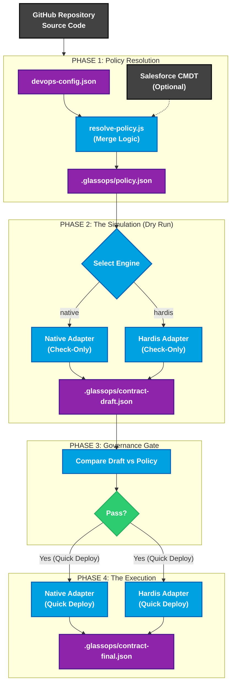
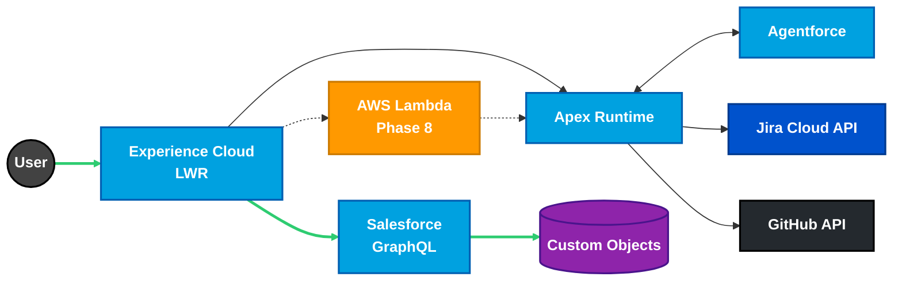

> _Extended Technical Portfolio – For in-depth discussions. Concise resume available upon request._

## Professional Summary

Principal-level Salesforce Platform Architect with **7+ years** designing governed, enterprise-grade Salesforce systems. Specializes in **architecture-first delivery**, **multi-cloud Salesforce/AWS systems**, **DevOps maturity**, and **resilience engineering**. Known for translating executive strategy into enforceable technical architecture.

## Professional Experience

**Salesforce Solutions Architect (Freelance)** | _Oct 2021 - Present_

- Acted as principal architect for Salesforce implementations across nonprofit and education sectors.
- **Metropolitan Community College Career Skills Grant Management:** Architected a state-funded grant management platform processing **$5M+ in workforce development funds**, implementing granular permission models and audit trails to meet public sector compliance requirements while reducing administrative overhead by 40%.
- Delivered executive architecture reviews, proofs of concept, and governance models.

**CRM Developer (Salesforce)** | Creighton University | _Aug 2025 - Present_

- Leading platform-level DevOps modernization and architectural standards.
- Advising IT leadership on roadmap planning and architectural risk management.
- Driving best practices for maintainability, scalability, and governance.

**Application Administrator** | Creighton University | _Jun 2021 - Aug 2025_

- Administered enterprise Service Cloud environments.
- Automated Experience Cloud onboarding and identity workflows.
- Supported large-scale Experience Cloud implementations (10,000+ users).

**CAET Services Specialist II** | Metropolitan Community College | _Jul 2017 - Jun 2021_

- Implemented Salesforce CRM for workforce programs and managed web content (HTML/CSS).

## Technical Projects

**GlassOps Governance Protocol**

Open Source | [GlassOps Repository](https://github.com/glassops-platform/glassops)

> **"GlassOps governs outcomes, not implementations."**

_A governance-first protocol for Salesforce CI/CD that separates policy enforcement from execution._

**Architecture Deep Dive:**

- **Phase 1: Policy Resolution:** Implements an additive merge model where the strictest policy wins (GitHub Env Vars > Team Policy > Org Defaults), ensuring security floors cannot be bypassed.
- **Phase 2: The Simulation:** Runs deployments in "Check-Only" mode using pluggable adapters (Native SFDX, sfdx-hardis), normalizing diverse tool outputs into a standard **Draft Contract**.
- **Phase 3: The Governance Gate:** A logic-only evaluation that compares the Draft Contract against the Policy. Bad code never leaves this phase.
- **Phase 4: The Execution:** Uses the "Quick Deploy" ID from Phase 2 to instantly promote the exact validated byte-code, ensuring zero drift between test and release.

### Salesforce Platform Architect Portfolio

Open-source, architecture-first reference implementation | [Live Governance Hub](https://rdbumstead.github.io/salesforce-platform-architect-portfolio/) | [Portfolio Repository](https://github.com/rdbumstead/salesforce-platform-architect-portfolio)

> **Architecture Diagram Summary:**
> The architecture implements a **Multi-Cloud Solution** centered on **Salesforce Experience Cloud (LWR)** and **GraphQL**.
>
> 1. **User Interaction:** Users interact with the LWR site, triggering **Salesforce GraphQL** queries.
> 2. **Core Logic:** Logic is handled by an **Apex Runtime** layer which orchestrates calls to **Agentforce AI**, **Jira Cloud API**, and **GitHub API**.
> 3. **Future State:** A planned integration with **AWS Lambda** (Phase 8) will extend compute capabilities.

**Key Architecture Artifacts:**

- Authored **6 enterprise architecture documents** including the [Systems Architecture Specification (SAS)](https://github.com/rdbumstead/salesforce-platform-architect-portfolio/blob/main/docs/guides/03-SAS.md), [Program Charter](https://github.com/rdbumstead/salesforce-platform-architect-portfolio/blob/main/docs/guides/02-Program-Charter.md), and [Executable Governance Guide](https://github.com/rdbumstead/salesforce-platform-architect-portfolio/blob/main/docs/guides/06-Guardrails-and-Executable-Governance.md).
- Documented **26 [Architectural Decision Records (ADRs)](https://github.com/rdbumstead/salesforce-platform-architect-portfolio/tree/main/docs/adr)** covering security, performance, AI governance, FinOps, and resilience.
- Designed a **multi-cloud architecture** using Salesforce LWR, Apex, Agentforce AI, and AWS Lambda.
- Implemented **contract-first APIs** ([System API](https://github.com/rdbumstead/salesforce-platform-architect-portfolio/blob/main/docs/api/oas/salesforce-sapi.md) & [Process API](https://github.com/rdbumstead/salesforce-platform-architect-portfolio/blob/main/docs/api/oas/portfolio-papi.md)) with OpenAPI 3.0 enforcing rate limiting, caching, and observability.
- Engineered **zero-touch CI/CD pipelines** with JWT authentication, delta deployments, and automated quality gates.
- Designed **chaos engineering and resilience simulation patterns** to validate graceful degradation of third-party integrations.

### "Resume as Code" CI/CD Pipeline

A "Zero-Touch" CI/CD pipeline treating professional career documentation as a software product | [Resume Repository](https://github.com/rdbumstead/resume-as-code)

- **Infrastructure as Code:** Architected an event-driven build pipeline transforming Markdown source into immutable PDF artifacts using **Node.js**, **Pandoc**, and **GitHub Actions**.
- **Security Architecture:** Implemented a "Secrets-First" design pattern, decoupling PII (Phone, Email) from the codebase using GitHub Secrets and Environment Variables to enable public repository visibility without data leakage.
- **Automated Governance:** Engineered custom Node.js scripts to audit hyperlinks, enforce formatting standards, and inject real-time portfolio statistics via the GitHub API prior to compilation.
- **Tech Stack:** GitHub Actions, Node.js, Docker, Mermaid.js, LaTeX.

**GitHub Marketplace Action: Setup Salesforce CLI** | [GitHub Marketplace](https://github.com/marketplace/actions/setup-salesforce-cli)

_A production-ready GitHub Action serving as the foundational kernel for enterprise Salesforce CI/CD pipelines._

- **Enterprise Resilience:** Engineered self-healing installation logic with exponential backoff strategies and cross-platform compatibility (Linux, macOS, Windows/PowerShell), achieving 99.9% pipeline reliability.
- **Governance as Code:** Implemented a `strict` mode input pattern, allowing organizations to enforce "break-build" policies on optional tooling failures (e.g., PMD, ESLint) dynamically.
- **Platform Architecture:** Architected as the base layer for a suite of modular Reusable Workflows, standardizing CI/CD practices and abstracting complexity for downstream repositories.
- **Security & Performance:** Designed granular caching keys based on CLI versions to reduce setup time by 80% (20s vs 2m) while enforcing JWT key rotation and secure cleanup.

## Technical Skills

- **Salesforce Platform:** Apex, LWC, Visualforce, SOQL/SOSL, Flow, Experience Cloud (LWR), Service Cloud, Agentforce
- **DevOps & Tooling:** GitHub Actions (Reusable Workflows), SFDX CLI, Git, JWT Auth, Docker, PMD, ESLint
- **Architecture:** C4 Modeling, REST & OpenAPI Design, Event-Driven Architecture, Multi-Cloud (AWS Lambda, S3), FinOps
- **General:** JavaScript (ES6+), SQL, HTML, CSS

## Education & Certifications

**Associate's Degree in General Studies**
_Metropolitan Community College (2025)_

**Salesforce Certifications:**

- Salesforce Certified Agentforce Specialist
- Salesforce Certified Data Cloud Consultant
- Salesforce Certified Education Cloud Consultant
- Salesforce Certified Platform App Builder
- Salesforce Certified Platform Administrator
- Salesforce Certified Platform Administrator II
- Salesforce Certified AI Associate
- Salesforce Certified Marketing Cloud Engagement Foundations

_[Verify credentials on Trailhead](https://www.salesforce.com/trailblazer/rbumstead)_
