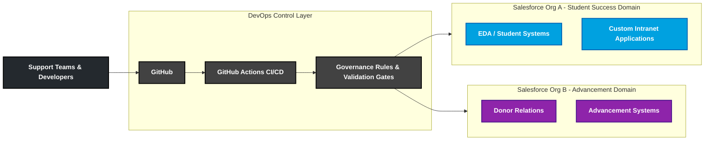
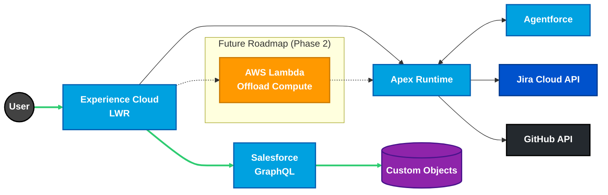
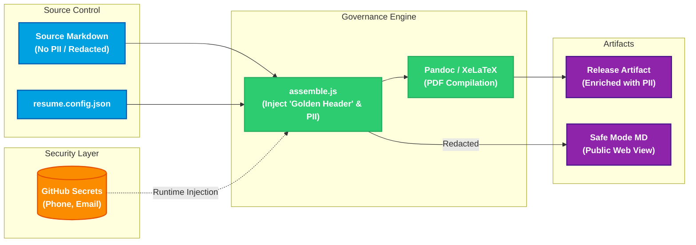

_Extended Technical Portfolio. This profile represents a comprehensive technical and architectural record, including experimental projects and evolving platform initiatives. This document is intentionally detailed. It is designed to demonstrate how architectural decisions are made, not just what technologies are used._

## Professional Identity

Salesforce Platform Architect with 7+ years designing, governing, and evolving Salesforce platforms in higher education and nonprofit environments. Experienced in multi-org architecture, DevOps platform engineering, and integration design across complex organizational domains.

Focuses on architecture-first delivery, governance-driven DevOps, and sustainable platform operating models that balance developer velocity with system integrity.

---

## Architectural Scope of Work

- Multi-org Salesforce platform architecture
- Platform governance and standards definition
- DevOps and CI/CD architecture for Salesforce ecosystems
- Integration and API architecture across SaaS and cloud services
- Organizational domain modeling and platform segmentation
- Technical leadership and platform enablement

---

## Core Technical Capabilities

### Salesforce Platform

- Apex, LWC, Flow, Experience Cloud (LWR), Service Cloud, Data Cloud, Marketing Cloud, Agentforce
- Multi-org architecture and metadata governance
- Security architecture and least-privilege access models
- Data lifecycle and platform governance

### DevOps & Platform Engineering

- GitHub Actions, SFDX CLI, JWT authentication
- CI/CD orchestration, automated validation, quality gates
- Branching strategies and release management
- Governance-first deployment models

### Systems Architecture, Languages & Data

- REST APIs, OpenAPI 3.0, event-driven patterns
- JavaScript, TypeScript, SQL, HTML/CSS
- Go, Python, YAML
- Docker containerization

---

## Platform Architecture Diagrams

The following diagrams illustrate multi-org architecture, governance protocols, platform portfolios, and automated resume generation pipelines. Each diagram is provided as a separate `.mermaid` file for clarity and maintainability.

### University Salesforce Multi‐Org Platform Architecture

### GlassOps Governance Protocol Flow

### Salesforce Platform Architect Portfolio Architecture

### Resume as Code Architecture

## Professional Experience

### Salesforce Solutions Architect (Freelance Consulting)

**Oct 2021 – Present**

- Designed Salesforce platforms for nonprofit and higher education organizations.
- Built grant and workforce systems supporting government-funded programs and compliance-driven workflows.
- Led architecture assessments and proofs of concept.
- Delivered custom Salesforce applications managing full lifecycle from requirements to production.
- Defined platform standards for security, data modeling, automation, and deployment practices.

**Key Project — Metropolitan Community College Career Skills Application:**

- Architected and developed a custom workforce development application using Contacts as Students.
- Designed and implemented custom objects: Employments, Training Programs, Training Courses, Tuition Assistance, Certifications, Supportive Programs, Supportive Services, Training Course Members, and Funding.
- Created Flow automations and Apex triggers with handler patterns to meet complex business requirements.
- Managed complete application lifecycle from planning through implementation and ongoing enhancements.

---

### CRM Developer / Technical Leadership Responsibilities

**Creighton University | Aug 2025 – Present**

_Official title: CRM Developer_  
_Functional role: Platform architecture and DevOps leadership_

- Architecting DevOps capabilities supporting two Salesforce orgs with distinct organizational domains:
  - Student success, EDA, and internal digital platforms
  - Advancement and donor relations systems
- Designing governance-driven DevOps models for multiple teams with different release cadences and priorities.
- Engineering CI/CD pipelines using GitHub Actions, SFDX CLI, JWT authentication, LWC/Jest testing, and automated validation gates.
- Defining architectural standards for Apex, LWC, asynchronous processing, and integration design.
- Designed comprehensive training plan for two new CRM Developers including Trailhead, Udemy, and curated certification paths.
- Training team members on ETL processes and Salesforce architecture dependencies.
- Preparing for MuleSoft transition from Talend, including DEX-401 certification pursuit.
- Acting as Salesforce technical lead for complex development beyond declarative capabilities.
- Advising IT and interdepartmental leadership on Salesforce-focused projects, incidents, and enhancements.

_Note: DevOps architecture is actively evolving and not yet fully mature at enterprise scale._

---

### Application Administrator

**Creighton University | Jun 2021 – Aug 2025**

**Salesforce CRM and Marketing Cloud:**

- Administered Service Cloud for 400+ internal users and Experience Cloud for 10,000+ external users.
- Implemented Flow automations and developed custom Apex solutions to improve operations.
- Supported Service Cloud for Financial Aid, Registrar, and Student Accounts using email-to-case.
- Worked with Salesforce EDA and Student Success Hub to enhance student engagement.
- Managed Marketing Cloud including synchronized data sources, SQL, AMPscript, and customer journeys.

**System Administration and Integrations:**

- Administered Talend runtime and remote engines, leading upgrade to Talend 8.0 and overseeing Change Data Capture operations.
- Integrated GatherContent with Salesforce Experience Cloud to streamline content workflows.
- Managed Ellucian Advance and SFTP operations for secure file transfers.

**Data Analytics and Reporting:**

- Developed and maintained SSRS reports for institutional stakeholders.
- Administered Power BI, managing user access, real-time dashboards, and troubleshooting.
- Automated processes using Power Automate, including SSL renewals and SFTP communications.

**Other Responsibilities:**

- Provided admin support for Team Dynamix, Tableau, and RabbitMQ.
- Collaborated with teams to design scalable, cross-platform solutions.
- Used Jira for project tracking and management of system upgrades and custom developments.
- Created documentation and delivered training to ensure adoption of new tools and processes.

---

### CAET Services Specialist II

**Metropolitan Community College | Jul 2017 – Jun 2021**

- Implemented Salesforce CRM from greenfield into active working environment, responsible for setup, development, and training.
- Served as Salesforce administrator, developer, and trainer for workforce and continuing education programs.
- Managed operations of the Center for Advanced and Emerging Technology.
- Administered Canvas LMS and Catalog by Instructure, supporting creation of non-credit courses and providing content development and maintenance.
- Served as Content Manager for Workforce Innovation Division website utilizing HTML5, CSS3, jQuery, and JavaScript.
- Developed automation workflows using Microsoft Forms, Teams, Outlook, Planner, and Power Automate, including creating an effective CARES scholarship intake system.
- Created ticket-based support system to streamline support services, increasing transparency, accountability, and communication.
- Served as Workforce Innovation Division Cost Center Delegate for all purchases via purchase card or requisition.
- Provided technical support to troubleshoot and maintain technology in the Center for Advanced and Emerging Technology.

---

### Non-Credit Instructor

**Metropolitan Community College | Dec 2017 – Jun 2021**

- Created and delivered non-credit curriculum focused on Prototype Design and Industrial Manufacturing.
- Instructed students in curriculum developed by Workforce Innovation Division and self-developed content.
- Developed safe and competent practices for students.

---

### IT Project Assistant

**Metropolitan Community College | Jan 2017 – Jul 2017**

- Assisted in all facets of prototyping: concept development, design, and fabrication.
- Provided troubleshooting for Fabrication Laboratory machines and equipment.
- Taught students, faculty, and clientele operation procedures for machine use.
- Facilitated regular tours for individuals and groups interested in the fabrication process.

---

### Earlier Career

- **First Data Corporation** — POS Technician (Jan 2016 – Oct 2016)
- **Max Pest Control** — IT/Network/Social Media Consultant (Oct 2014 – Mar 2016)
- **Uber** — GIS Analyst (Aug 2015 – Nov 2015)
- **Microsoft** — GIS Analyst (Mar 2015 – Aug 2015)
- **Walmart** — Customer Service Manager (Mar 2012 – Jun 2014)

---

## Technical Projects

### GlassOps Governance Protocol (Open Source)

**Status: Active Development**

- Designing a governance-first DevOps framework for Salesforce.
- Defining control-plane architecture independent of CI/CD tooling.
- Standardizing deployment contracts and validation gates.
- Implementing policy arbitration across organizational, team, and environment boundaries with immutable audit trails.

_Note: GlassOps is experimental and not deployed in enterprise production environments._

---

### Salesforce Platform Architect Portfolio

- Authored 26 Architectural Decision Records, Systems Architecture Specification, and four other documentation artifacts.
- Designed API-first integration architectures using OpenAPI 3.0.
- Architected contract-first APIs with Apex orchestration.
- Planned Experience Cloud LWR frontend with GraphQL data access and governed customization boundaries.
- Implemented automated CI/CD workflows with controlled failure testing.
- Integrated Agentforce within defined governance boundaries.

---

### Resume as Code

**Status: Released (v2.1.0)**

- Built an event-driven pipeline converting Markdown into immutable PDF artifacts.
- Decoupled PII using GitHub Secrets for safe public repository visibility.
- Implemented automated formatting and link validation.
- Engineered multi-stage assembly process with source layer, build layer, and distribution layer.

---

### Setup Salesforce CLI (GitHub Marketplace)

**Status: Released (v3.0.0)**

- Engineered an enterprise-grade composite GitHub Action for initializing deterministic Salesforce CI/CD environments.
- Implemented exponential backoff strategies and robust error handling.
- Designed intelligent caching engine generating SHA-256 hash keys based on tooling inputs, reducing pipeline setup time by ~80%.
- Built invariant validation logic to ensure “fail-fast” behavior.
- Validated cross-platform compatibility across Ubuntu, macOS, and Windows runners.

---

## Education & Certifications

**Associate's Degree in General Studies** — Metropolitan Community College (Completed 2025)

**Salesforce Certifications:**

- Platform Administrator I & II
- Platform App Builder
- Agentforce Specialist
- Data Cloud Consultant
- Education Cloud Consultant
- AI Associate
- Marketing Cloud Engagement Foundations

**MuleSoft Training:**

- DEX-401: Essentials of Anypoint Platform Development (Completed)

**Trailhead:**

- 3x Ranger
