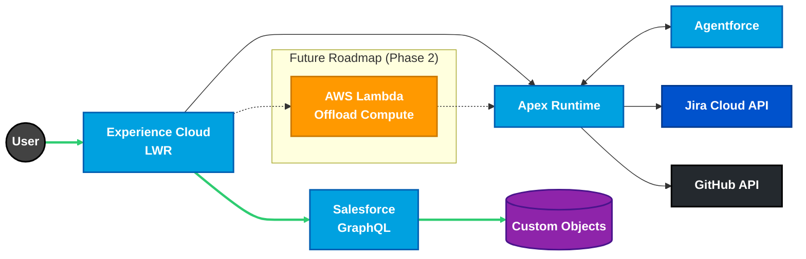

_Extended Technical Portfolio_
_Intended for architecture, platform, and engineering leadership discussions._

## Professional Summary

Salesforce Platform Architect with 7+ years designing governed Salesforce ecosystems for enterprise and public-sector organizations. Specializes in architecture-first delivery, DevOps maturity, and Salesforce-centric multi-cloud systems. Known for translating executive intent into enforceable technical architecture and defining delivery standards that scale across teams and tooling.

_This document is intentionally detailed. It is designed to demonstrate how architectural decisions are made, not just what technologies are used. It should be read as a platform narrative rather than a traditional resume._

---

## Professional Experience

### Salesforce Solutions Architect (Freelance) | Oct 2021 - Present

- Act as principal architect for Salesforce implementations across nonprofit, education, and public-sector environments.
- Architect compliance-driven platforms processing $5M+ in public funding, enforcing auditability, least-privilege access, and traceable operational controls.
- Lead executive architecture reviews, proofs of concept, and platform governance discussions to guide long-term investment and risk reduction.
- Balance delivery velocity with system integrity by defining clear architectural boundaries and governance contracts.

### CRM Developer (Salesforce) | Creighton University | Aug 2025 - Present

- Champion DevOps modernization and architectural standards adoption for the university Salesforce platform.
- Defining the organization's first formal Salesforce DevOps governance model, establishing deterministic validation and controlled release promotion to eliminate deployment failures.
- Design structured certification and training paths for developers and administrators, including Salesforce platform fundamentals and MuleSoft integration curriculum (DEX-401: Essentials of Anypoint Platform Development).
- Advise IT leadership on roadmap planning, architectural dependencies, and platform risk management.
- Act as technical authority for Apex, asynchronous processing, and LWC development beyond declarative limits.

---

## GlassOps Governance Protocol (Open Source)

GlassOps is an open-source governance protocol currently under active development. It represents a reference implementation of governance-first Salesforce DevOps, with early adapters and execution engines being built and validated. The system enforces outcomes independent of how deployments are executed, allowing teams to adopt or replace tools without weakening compliance guarantees.

### Architectural Intent

- Prevents automation of chaos by requiring explicit policy definition before execution.
- Normalizes deployment outcomes across heterogeneous tooling.
- Produces immutable audit artifacts suitable for regulated environments.

### GlassOps Architectural Flow (Detailed)

- **Policy Resolution:** Implements a strictest-policy-wins merge model (Environment, Team, Org), ensuring security floors cannot be bypassed by local configuration.
- **Simulation Phase:** Executes deployments in check-only mode via pluggable adapters. Tool-specific output is normalized into a standard Draft Contract.
- **Governance Gate:** Evaluates the Draft Contract against resolved policy. Invalid architecture or quality violations are blocked before promotion.
- **Execution Phase:** Promotes the exact validated byte-code using quick-deploy semantics, ensuring zero drift between validation and release.

This model allows governance guarantees to remain stable even as delivery tooling evolves.

## Salesforce Platform Architect Portfolio

### Architectural Intent

- **Governance First:** Treats configuration as code, ensuring all changes are auditable and reproducible.
- **Resilient Multi-Cloud:** Leverages AWS Lambda for off-platform compute, reducing dependence on Salesforce execution limits.
- **API Centricity:** Uses contract-first design (OpenAPI 3.0) for predictable and governed integration patterns.
- **AI Augmented:** Integrates Agentforce within defined boundaries to maintain platform integrity.

### Portfolio Architecture Overview

- **Core Platform:** Salesforce Experience Cloud (LWR) serves as the primary user interface.
- **Logic Layer:** Apex orchestrates business logic and integrations.
- **AI Integration:** Agentforce augments workflows while remaining governed by platform controls.
- **External Systems:** Jira and GitHub integrations are mediated through defined APIs.
- **Selective Off-Platform Compute:** AWS Lambda is introduced intentionally for compute-heavy or failure-prone operations.

### Key Architecture Artifacts

- Authored **Systems Architecture Specification (SAS)** defining platform boundaries and responsibilities.
- Maintained **26 Architectural Decision Records (ADRs)** covering security, FinOps, resilience, and AI governance.
- Designed **contract-first APIs** using OpenAPI 3.0 with enforceable rate limiting, caching, and observability requirements.
- Engineered zero-touch CI/CD pipelines with deterministic validation and controlled release promotion.
- Implemented resilience and controlled failure testing to validate graceful degradation of third-party dependencies.

---

## Additional Platform Work

### Resume as Code

- Event-driven CI/CD pipeline treating professional documentation as immutable artifacts.
- Secrets-first architecture decoupling PII from source control.
- Automated governance enforcing formatting, link integrity, and build consistency.

### Setup Salesforce CLI (GitHub Marketplace)

- Enterprise-grade GitHub Action providing deterministic Salesforce CLI environments.
- Designed as a foundational primitive for reusable workflows and governing delivery.
- Reduced CI setup time by 80% while enforcing authentication and execution invariants.

## Education and Certifications

**Associate's Degree in General Studies** : Metropolitan Community College (Completed 2025)

**Salesforce Certifications:** Platform Administrator I and II, Platform App Builder, Agentforce Specialist, Data Cloud Consultant, Education Cloud Consultant, AI Associate, Marketing Cloud Engagement Foundations.
